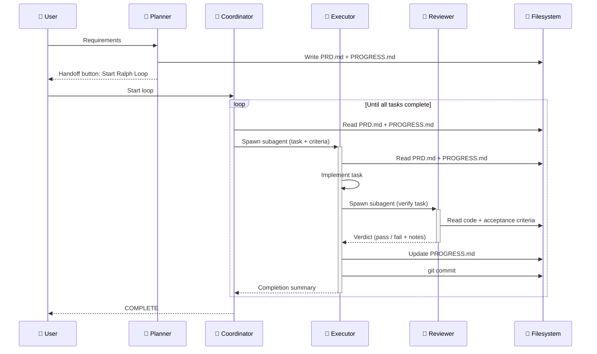

# Copilot Ralph Loop

A lightweight Copilot implementation of the autonomous agent loop [**Ralph Wiggum as a "software engineer** pattern by Geoffrey Huntley](https://ghuntley.com/ralph/), using custom agents with automatic handoffs.

<p align="center"></p>

Based off only four `agent.md` markdown files, this pattern enables an **autonomous coding loop** with **fresh context every iteration**, using the filesystem as memory and `git` for version control.

## What is Ralph Loop?

**Ralph loop = Fresh context + Filesystem memory & Git versioning**

An autonomous coding pattern where:

0. User provides requirements to a `RalphPlanner` agent, which creates a `PRD.md` with a list of specific tasks and file to track progress `PROGRESS.md`
1. User reviews `PRD.md` and starts the loop with `RalphCoordinator` agent who dispatches tasks to `RalphExecutor` agents.
2. `RalphExecutor` agent picks a task from `PRD.md`
3. Executes it with **fresh context**, code is tested and quality checks ensured
4. `git` commits and updates `PROGRESS.md`
5. Code is reviewed by `RalphReviewer`
6. Loops until all tasks complete

### Execution Flow



## Features

- 🤝 **Automatic handoffs** - Agents pass control automatically with fresh context
- 📝 **Progress file and filesystem memory** - Fresh context every iteration via `PROGRESS.md` and `git`
- 🌐 **Language agnostic** - Works with any programming language/stack
- ⚛️ **Atomic tasks** - One task per iteration, committed immediately
- 🔄 **Context reset** - Avoids context pollution, uses filesystem as memory
- 🔍 **Built-in review** - Reviewer subagent verifies every task before moving on
- ✅ **Code that lasts** - Maintainable code with tests and quality checks at every iteration

## Compatibility

- 🖥️ **VS Code Copilot** - save agents in the workpace `.github/agents` or [customize your settings.json](#Installation)
- 🤖 **Copilot CLI** - save agents in workspace `.github/agents` or in global `~/.copilot/agents`

## Setup

### Installation

1. Clone repository and copy agent files to your project:

```bash
git clone git@github.com:giocaizzi/ralph-copilot.git
cp ralph-copilot/agents/*.agent.md <your_project>/.github/agents/
```

2. Restart VSCode/Copilot CLI

3. Verify agents are available:
   - Open Command Palette (`Cmd+Shift+P` / `Ctrl+Shift+P`)
   - Type "Select Agent"
   - Should see: `RalphPlanner`, `RalphCoordinator`

> 💡 **Tip — use Ralph globally across all your projects**
>
> *VSCode*:
> Instead of copying agent files per project, point VS Code to your local clone of this repo once via
> [](vscode://settings/chat.agentFilesLocations)
> and the agents will be available everywhere.
>
> ```jsonc
> // settings.json
> "chat.agentFilesLocations": {
>     "/your/path/to/ralph-copilot": true
> }
> ```
>
> *Copilot CLI*
> Save your agents in the global folder `~/.copilot/agents`

## Usage

### Quick Start

1. **Create PRD** with `RalphPlanner` agent:

   ```
   Open VSCode Chat
   Select: Planner agent
   Prompt: "Create a PRD for [your feature]"
   ```

2. **Review PRD.md** - Edit as needed

3. **Start Loop** with `RalphCoordinator` agent:

   ```
   Select: Coordinator agent
   Click: "Start Ralph Loop" handoff button
   ```

4. **Let it run** - Agents will:
   - Pick tasks from PRD.md
   - Execute them
   - Update PROGRESS.md
   - Commit changes
   - Review, test and run quality checks
   - Repeat until done

5. **Monitor progress** in PROGRESS.md and git history

## Credits

Based on:

- [**Ralph Wiggum as a "software engineer** pattern by Geoffrey Huntley](https://ghuntley.com/ralph/)
- [Ralph](https://github.com/snarktank/ralph)
- [VSCode Custom Agents Docs](https://code.visualstudio.com/docs/copilot/customization/custom-agents)
- [Claude Code Ralph Loop](https://github.com/anthropics/claude-code/blob/main/plugins/ralph-wiggum/README.md)
